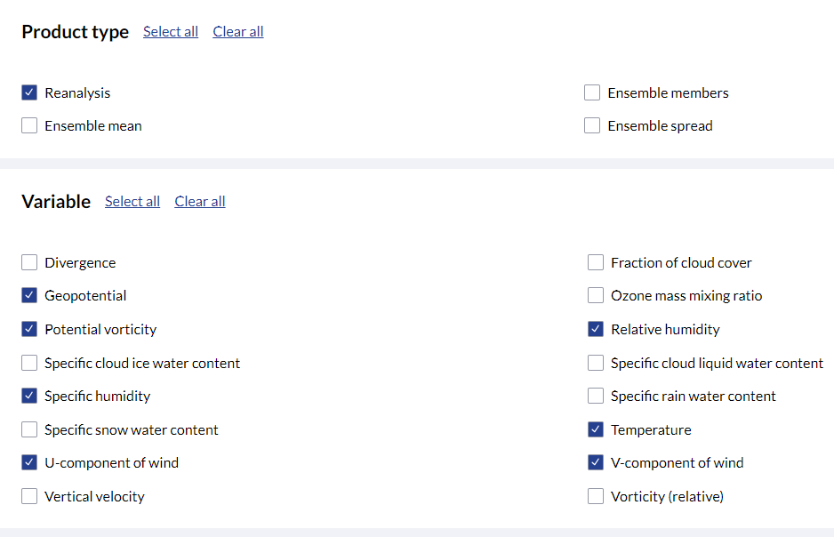

# Climate function helpers for ClimaCCF library

## 1. Setup

### 1.1 Installation

Install dependencies with the requirement file. With pip:

```
pip install -r requirements.txt
```

In case you run into trouble for the two specific libraries, you can do (first is optional, second is not):

```
pip install git+https://github.com/UoW-ATM/read_all_ft.git@9fd4d5cafa35d1b8bf34c3418a5f47da05ccf554
pip install git+https://github.com/dlr-pa/climaccf.git@018471922764b649ef23285f64919243b68a19b6
```

The climaccf library is compulsory, but if you have already installed somewhere you can pass the path to the functions
(see 2.1),

### 1.2 ERA5 Data

The data needed is ERA5 reanalysis and can be obtained from https://cds.climate.copernicus.eu/.
The registration to ECMWF is required, but it is free. 

The pressure data should be gotten from ERA5 hourly data on pressure levels from 1940 to present dataset.
The needed variables are shown in the figure below:



Then choose, year, month, day, time, and then pressure level. Pressure is given in hPa. ICAO Annex 3 gives the following
list for the correspondence between hPa and flight levels (FLs): geopotential altitude data for flight 
levels 50 (850 hPa), 100 (700 hPa), 140 (600 hPa), 180 (500 hPa), 240 (400 hPa), 270 (350 hPa) 300 (300 hPa),
320 (275 hPa), 340 (250hPa), 360 (225 hPa), 390 (200 hPa), 450 (150 hPa) and 530 (100 hPa).

Further filtering can be done by limiting geographic region for which to download data.
The sample files included in the library have the following limits:

    Latitude range: (np.float32(33.0), np.float32(73.5))

    Longitude range: (np.float32(-27.0), np.float32(45.0))

Then grib or netCDF can be chosen. We should choose netCDF.

The second data set is the surface data, and for that we need ERA5 hourly data on single levels from 1940 to present.
We need the following data here:


Then the same - choose year, month, day, time, netcdf.

## 2. Composition

### 2.1 ERA5 to climate impact

Main entry point: `compute_climate_impact` function in `era5_to_climate_impact.py`.

Given era5 data in `.nc` format, produces an `.nc` file with climate impact of a given engine, using the climaccf library: 
https://github.com/dlr-pa/climaccf.

Typical use:

```python
compute_climate_impact(era5_input_path / mod_file,
                       era5_input_path / surface,
                       config_dict_climaccf={'ac_type': 'wide-body'})
```

To run it you need a "mod" ERA5 files and a "surface" ERA5 file (see 1.2). You can set any parameter for the climaccf
with the `config_dict_climaccf` argument. Note that you can also pass a full config file using:

```python
climaccf_config_user_file=path_to_config
```

A config file is used by default by climaccf, `climaccf_config_user.yml` in the root folder, and the arguments passed through
`config_dict_climaccf` supersede it.

Finally, if you have already installed climaccf somewhere and you want to use that installation, pass:

```
climaccf_lib_path=path
```

to the function above.


### 2.2 Hotspot computation (optional)

Main entry point: `compute_hotspots_from_climate_impact` from `hotspot_computation.py`

Given a climate impact file, creates an `.nc` file with one binary variables corresponding to hotspots.

Typical use:

```python
compute_hotspots_from_climate_impact(env_impact_file=output_of_first_step,
                                     threshold=1e-9,
                                     variable_name_for_threshold="aCCF_merged")
```

### 2.3 Compute trajectories (optional)

Main entry point: `compute_trajectories` in `lib/trajectory_construction`.

This is coming directly from the open library https://github.com/UoW-ATM/read_all_ft.

Compute trajectories based on DDR ALLFT+ data. Format in input is allft+, format in output is:

| Longitude | Latitude | FL | Timestamp | elapsed_time | GS | vertical_rate | fuel_flow | fuel | ifps_id | tact_id | origin | destination | ac_type | pressure_Level |
|-------|-----|------------| ------------|------------|------------|------------|------------|------------|------------|------------|------------|------------|------------|------------|
| 4.764166666666667 | 52.308055555555555 | 0.0 | 2019-09-01 19:22:00 | 0.0 | 0.0 | 0.0 | 0.0 | 0.0 | AA17484092 | 697364 | EHAM | EKCH | B738 | 1013 |
|4.733055555555556 | 52.36361111111111 | 35.0 | 2019-09-01 19:23:12 | 72.0 | 176.0 | 2916.0 | 2.1596402493251556 | 155.49409795141122 | AA17484092 | 697364 | EHAM | EKCH | B738 | 891 |
|4.715277777777778 | 52.39527777777778 | 51.0 | 2019-09-01 19:23:37 | 25.0 | 289.0 | 3840.0 | 2.1114527125101987 | 52.786317812754966 | AA17484092 | 697364 | EHAM | EKCH | B738 | 839 |
| 4.719444444444445 | 52.439166666666665 | 70.0 | 2019-09-01 19:24:08 | 31.0 | 306.0 | 3677.0 | 2.0799385780489823 | 64.47809591951845 | AA17484092 | 697364 | EHAM | EKCH | B738 | 781 |

Typical use:

```python
compute_trajectories(allft_path=allft_path,
                         flight_ids=['697364'], # tactical ids of the flights to extract
                         output_path="trajectories.csv",
                         interpolation_distance_km=15)
```

### 2.4 Compute emissions

Main entry point: 

Typical use:

```python
df_trajs = pd.read_csv(trajectories.csv)

all_results = compute_all_flights_emissions(df_trajs,
                                            climate_file_path=climate_file_path
                                            )

```

`trajectories.csv` can be the output of the previous step, and needs in any case to have the format indicated there.
`climate_file_path` is the output of the first step


### 2.5 Pipelines

Convenient functions to compute everything at the same time.

Typical use:

```
compute_all_emissions_from_all_ft(era5_input_path=era5_input_path,
                                  era5_name_list=['DEC2019'], # to compute several files. The function will look for {era5_name_list}_mod.nc and {era5_name_list}_surface.nc.
                                  working_directory='test_pipeline_all_ft', # to put all output in the same place
                                  compute_hotspot=True,
                                  allft_path=allft_path,
                                  flight_ids=['697364'],
                                  )
```